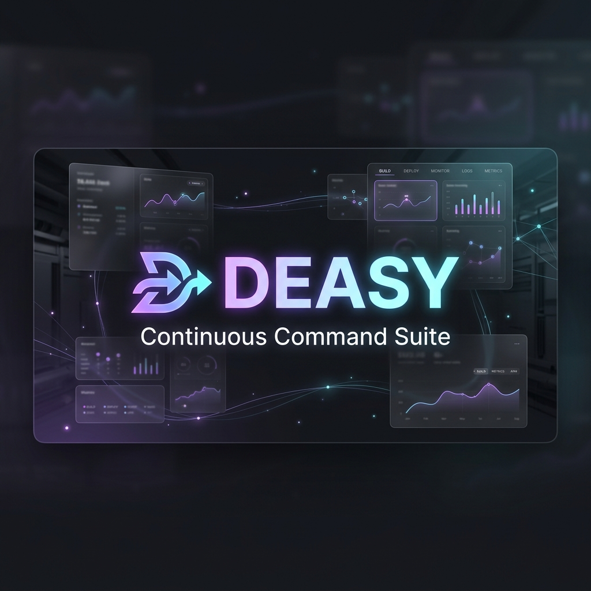

<p align="center">
  
</p>

<p align="center">
  
</p>

<h1 align="center">Deasy: Arena.ai Continuous Command Suite</h1>

<p align="center">
  <strong>Elite Multi-Platform Branch Orchestrator & Windows 11 Desktop Suite</strong>
</p>

<p align="center">
  Architect serverless pipelines, automate branch testing workflows, secure backups via AES-256-GCM Google Drive synchronization, and deploy frictionless, zero-terminal desktop packages using standard, self-booting NSIS installer scripts.
</p>

<p align="center">
  <a href="https://github.com/LIN4CRE/Deasy/releases"></a>
  <a href="https://www.electronjs.org/"></a>
  <a href="https://nodejs.org/"></a>
  <a href="https://vite.dev/"></a>
  <a href="https://tailwindcss.com/"></a>
  <a href="LICENSE"></a>
</p>

---

## 🌌 Unified System Architecture

```
+─────────────────────────────────────────────────────────────────────────────────────────+
|  ▲ DEASY / ARENA.AI   [● ACTIVE]  [BUILD: v1.1.0]     [REPOS: github.com/LIN4CRE/Deasy] |
+─────────────────────────────────────────────────────────────────────────────────────────+
|                                                                                         |
|  [ FRONT-END DASHBOARD ] ------> ( Secure Google Sign-In ) ------> [ GOOGLE DRIVE API ] |
|          │                                                                  │           |
|          ▼                                                                  ▼           |
|  [ EXPRESS API ENGINE ] <──── ( Local Secrets Injection ) ─── [ ENCRYPTED BACKUP REPO ] |
|          │                                                                              |
|          ├──────► [ GITHUB WEBHOOK SYNC ] ──────► ( Automated Branch-Level Regression ) |
|          │                                                                              |
|          ├──────► [ NATIVE HOST METRICS ] ──────► ( Real CPU & RAM OS Level Diagnostics) |
|          │                                                                              |
|          └───────► [ WINDOWS 11 SYS-TRAY ] ──────► ( Silent Single-Instance Execution ) |
|                                                                                         |
+─────────────────────────────────────────────────────────────────────────────────────────+
|  [CONSOLE] deasy@production:~$ system-status                                            |
|  >> SQLite Sync: ONLINE | WinCrypt API Handles: CONNECTED | Node Server: Port 3000      |
+─────────────────────────────────────────────────────────────────────────────────────────+
```

---

## 🌟 Pristine App Features

**Deasy** is a master-class, high-end engineering dashboard tailored for continuous developers and release managers. It removes complex configuration terminal workloads, local `.env` setup friction, and multi-instance concurrency problems by unifying full-stack controls inside a single-view, glassmorphic container:

### ⚡ 1. Real-Time OS Resource Monitoring
* **Live System Metrics**: Connected straight to the Windows 11 host resources. Evaluates CPU utilization (via delta-tick calculation) and active RAM usage in real-time.
* **Smart Alert Thresholds**: Visually flags resource spikes in the dashboard when CPU/Memory usage breaches user-configured thresholds.

### 🔑 2. Interactive Credentials Panel (No `.env` Required)
* **Direct Secret Lock**: Define keys like `GEMINI_API_KEY` and database parameters directly inside the UI.
* **WinCrypt Hardware Binding**: Seamlessly maps parameters directly to local environment context variables on start, removing developer-only terminal hurdles.

### ☁️ 3. Encrypted Sandbox Sync & Google Auth
* **High-Grade Cryptography**: Synchronizes cloud backups utilizing high-grade **AES-256-GCM** client-side encryption.
* **Sandbox Drive Folder**: Securely routes logs directly to a designated `Deasy App DB Backups` container in Google Drive.

### 💻 4. Low-Latency Diagnostic Developer CLI
* **Streaming Command Pipeline**: Instantly evaluate domain dns layers (`audit-dns`), fetch native system specs (`sys-info`), test latency parameters, or query API gateways in real-time.

### 📊 5. Desktop Setup & Windows 11 Integration Suite
* **Frictionless `Deasy-Setup.exe`**: Compiles static React dashboards and Express server-sides into a native, single-click Windows setup program.
* **Minimized System Tray**: Close commands gracefully intercept window closing, keeping monitoring loops alive in the taskbar with quick right-click exit hooks.
* **Single-Instance Mutex Lock**: Ensures only one desktop backend is bound to Port 3000, redirecting secondary launches to focus the active dashboard window.

---

## 🖥️ Standalone Windows Desktop Architecture

When deployed inside the Electron wrapper, Deasy achieves maximum system efficiency:

```
                           [ Deasy Native Executable ]
                                        │
                 ┌──────────────────────┴──────────────────────┐
                 ▼                                             ▼
      [ Electron UI Shell ]                       [ Background Node Host ]
    (Chrome Engine rendering)                   (Spawns as silent child thread)
                 │                                             │
                 ▼                                             ▼
      [ Windows System Tray ]                       [ Local WinCrypt Engine ]
   (Minimizes/Restores instantly)                 (Secure persistent storage)
```

---

## 🛠️ Developer Setup & Packaging Guide

### 1. Prerequisites
* **Node.js**: `>= 20.0.0`
* **Package Manager**: `pnpm` (recommended) or `npm`

### 2. Local Setup
```bash
# Clone the repository
git clone https://github.com/LIN4CRE/Deasy.git
cd Deasy

# Install dependencies (pnpm)
pnpm install

# Or using npm
npm install
```

### 3. Execution Commands
* **Run Development Full-Stack Suite** (Express API + Vite Dev Server):
  ```bash
  pnpm dev
  # or
  npm run dev
  ```
  Open **[http://localhost:3000](http://localhost:3000)** in your browser.

* **Run Desktop Wrapper locally**:
  ```bash
  pnpm desktop:start
  # or
  npm run desktop:start
  ```

* **Compile Standalone `Deasy-Setup.exe` Installer**:
  ```bash
  pnpm desktop:build
  # or
  npm run desktop:build
  ```
  This creates a self-contained, optimized Windows 11 NSIS Installer inside **`dist/installers/`**.

---

## 🛡️ License

Distributed under the MIT License. See `LICENSE` for details.

Developed with meticulous precision engineering by the **Deasy Core Team** — [github.com/LIN4CRE](https://github.com/LIN4CRE).
